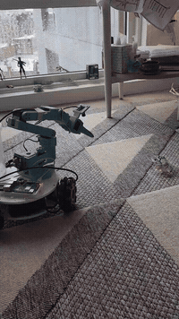
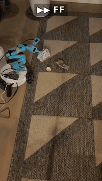

# garbagecollector

A [LeKiwi](https://github.com/SIGRobotics-UIUC/LeKiwi) mobile robot with an SO-101 arm that finds small trash on the
floor, picks it up, checks that it really has it, and drops it in a bin it carries. Then it backs up and looks for the
next piece.

| Pick up and bin (side view) | Autonomous cleanup (top-down, sped up) |
|---|---|
|  |  |
| [full video](docs/media/pick-and-bin.mp4) | [full video](docs/media/autonomous-cleanup.mp4) |

Trash is recognised by a local vision-language model (Qwen3-VL-4B running in llama.cpp), not a trained detector, so it
picks up wrappers, paper, peels and fruit without a custom dataset.

> This drives a real robot with an arm. Keep the area clear, keep a hand near **STOP** (or the power switch), and
> expect to tune it for your build.

## How it fits together

```
 ┌──────────────── LeKiwi (Raspberry Pi) ────────────────┐          ┌──────────────────── Computer (GPU) ─────────────────────┐
 │                                                       │          │                                                         │
 │  STS3215 servo bus ──┐                                │          │  autonomy/control_server.py   http://<computer>:8080   │
 │  (arm ids 1-6,       │                                │          │   ├─ web control page (manual drive, arm, settings)    │
 │   wheels 7-9)        ├─ pi/lekiwi_ws.py ── WebSocket ─┼── :8765 ─┼─  ├─ camera worker + hybrid targeter ────────┐         │
 │  USB wrist camera ───┘   (systemd: robopet.service)   │          │   ├─ auto loop: search / approach / wander   │  HTTP   │
 │                                                       │          │   └─ grab: dive, grip, check, bin, retry     ▼         │
 └───────────────────────────────────────────────────────┘          │  llama-server + Qwen3-VL-4B (GGUF) ─────── :8091       │
                                                                    └─────────────────────────────────────────────────────────┘
```

**Raspberry Pi (on the robot)** runs one small program, `pi/lekiwi_ws.py`. It has no intelligence: it streams the
camera, reports the motors, and executes motor commands. It
- talks to the Feetech STS3215 servos through [rustypot](https://github.com/pollen-robotics/rustypot) (arm in position
  mode, wheels in speed mode) and publishes joint positions, loads and currents about 5 times a second;
- streams the USB wrist camera as MJPEG (via ffmpeg, 640x360) and applies exposure settings sent by the computer;
- stops the wheels if no command arrives for 0.7 s (watchdog);
- stores the arm's home pose in `~/robopet/home_pose.json`.

**The WebSocket (port 8765)** is the only link between the two. Binary messages are JPEG camera frames; text messages
are JSON: `state` telemetry from the Pi, and commands from the computer (`joints`, `drive`, `stop`, `home`,
`camera_settings`, `arm_torque`, ...).

**The computer** does all the processing and serves the control page:
- `autonomy/control_server.py` connects to the Pi, serves the browser UI on port 8080, and runs the camera worker, the
  auto loop and the grab routine.
- `autonomy/vlm_targeting.py` is the **hybrid targeter**. Qwen3-VL finds candidate trash about twice a second and a
  fast CSRT tracker follows it between answers (late answers are re-seeded on the frame the model looked at). Each
  candidate is also asked "trash or keep?" on the full frame, with per-object votes remembered by appearance, so boxes,
  sealed bags and labels are ignored.
- `autonomy/wrist_ik.py` does inverse kinematics for the SO-101 arm from its URDF (`web/so101/`).
- **llama.cpp's `llama-server`** runs Qwen3-VL-4B-Instruct (Q4_K_M) on the GPU; about 0.3-0.5 s per question on a laptop
  RTX 4070.

### What auto mode does

1. **Search**: turn in place until the targeter locks onto trash. After a full turn with nothing found, turn to a random
   heading and drive 30-80 cm (the VLM is asked whether the path ahead is clear first and during the drive), then search again.
2. **Approach**: drive in while steering and pitching the wrist to keep the target centred; forward travel only while
   the target is recently confirmed and fully in view.
3. **Grab**: dive the gripper along the camera ray with visual servoing, settle at the bottom, close fully.
4. **Grasp check**: lift ~12 cm; it's held if the jaws didn't fully close, or if the VLM sees something held.
   On a miss: open, back up, re-approach and retry (3 attempts, then back off and scan elsewhere).
5. **Bin**: replay the taught placement keypoints into the bin, back up 25 cm, and resume searching.

## Hardware

- **LeKiwi** mobile base with an **SO-101** arm, a Raspberry Pi, and the wrist camera. Build and wire it following the
  [LeKiwi](https://github.com/SIGRobotics-UIUC/LeKiwi) instructions, and set up and calibrate the motors with
  [LeRobot](https://github.com/huggingface/lerobot) ([LeKiwi guide](https://huggingface.co/docs/lerobot/lekiwi)).
  This project expects the LeKiwi motor ids (arm 1-6, wheels 7-9) on `/dev/ttyACM0`.
- A **bin** mounted on the robot within the arm's reach.
- A **computer with a GPU** on the same network (developed on Windows 11 with an RTX 4070 Laptop, 8 GB; any GPU that
  llama.cpp supports should work).

## Setup

### 1. Raspberry Pi

```bash
# on the Pi (Raspberry Pi OS), in ~/robopet
git clone https://github.com/ultrafro/garbagecollector.git ~/robopet
pip install --user websockets numpy rustypot
sudo apt install ffmpeg v4l-utils
python3 ~/robopet/pi/lekiwi_ws.py --host 0.0.0.0 --port 8765     # try it by hand first
```

To start it on boot, install the systemd unit (edit the user and paths in it if yours differ):

```bash
sudo cp ~/robopet/pi/robopet.service /etc/systemd/system/
sudo systemctl enable --now robopet
```

`deploy-pi.sh user@<pi-address>` copies an updated `lekiwi_ws.py` to the Pi and restarts it. Note that restarting the
bridge turns the arm's torque off for a moment, so support the arm.

### 2. Computer

```bash
git clone https://github.com/ultrafro/garbagecollector.git && cd garbagecollector
python -m venv .venv && .venv/Scripts/activate            # Linux/macOS: source .venv/bin/activate
pip install -r requirements-server.txt
```

Install [llama.cpp](https://github.com/ggml-org/llama.cpp) (on Windows: `winget install ggml.llamacpp`) and download
the model:

```bash
huggingface-cli download Qwen/Qwen3-VL-4B-Instruct-GGUF Qwen3VL-4B-Instruct-Q4_K_M.gguf mmproj-Qwen3VL-4B-Instruct-F16.gguf
```

### 3. Run

Windows (starts llama-server if needed, then the control server):

```powershell
.\run-local.ps1 -Vlm -Pi ws://<pi-address>:8765
```

Anywhere else:

```bash
llama-server -m Qwen3VL-4B-Instruct-Q4_K_M.gguf --mmproj mmproj-Qwen3VL-4B-Instruct-F16.gguf -ngl 99 -c 4096 --port 8091
python -m autonomy.control_server --pi ws://<pi-address>:8765 --targeter vlm
```

Open `http://localhost:8080`.

### 4. Teach it your robot

On the control page:
- **Home pose**: move the arm so the camera looks ahead and slightly down at the floor, then
  **Set current pose as home**.
- **Bin placement**: **Release arm for teaching**, move the arm by hand, and **Capture keypoint** for `lift`, `over`,
  `in`, `release`, `out` and `reset` (the carry from the grasp into your bin and back). They are saved to
  `recordings/placement-keypoints.json`; the ones in this repo are for the author's robot and bin.
- Then press **Start auto mode**.

## Tuning and logs

Most behaviour is a command-line flag on `autonomy.control_server` (`--help` lists them all). Useful ones:
`--grab-attempts`, `--place-backup`, `--wander-after-deg`, `--vlm-verify-max-age`, `--wrist-feedforward`,
`--camera-backlight` (auto-exposure brightness target), `--no-auto-grab` (approach only).

While it runs it writes:
- `recordings/auto-log/auto-YYYYMMDD.csv`: every auto-mode control tick (target error, commands, wrist angles);
- `screenshots/grab-dive-*.csv`: every dive step, including where the target sat in the image;
- `recordings/grasp-checks/<time>/`: the image and votes of every grasp check, for labelling;
- the server's log output (stderr): every targeter, auto-mode and grab decision.

`scripts/` has tools used during development: recording a grab with all telemetry (`record_grab.py`), rendering and
comparing grab videos, replaying recordings through the targeter, and evaluating VLM prompts on saved frames.

## Tests

```bash
pip install pytest
python -m pytest tests
```

Some older grab/contact-detection tests (`tests/test_contact.py`, one in `tests/test_wrist_ik.py`) predate the current
grab routine and currently fail.

## License

MIT (see [LICENSE](LICENSE)). Third-party files and models keep their own licenses; see
[THIRD_PARTY_NOTICES.md](THIRD_PARTY_NOTICES.md).
